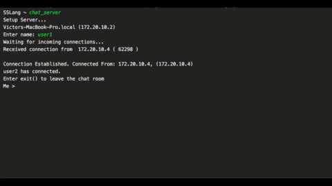

  <h3 align="center">SimpleSocketLang</h3>

  <p align="center">
    Simplicity is King.
    <br />
    <br />
    <br />
  </p>
</p>


<!-- TABLE OF CONTENTS -->
## Table of Contents

* [About the Project](#about-the-project)
  * [Built With](#built-with)
* [Getting Started](#getting-started)
  * [Prerequisites](#prerequisites)
  * [Installation](#installation)
* [Usage](#usage)
* [Roadmap](#roadmap)
* [Contributing](#contributing)
* [License](#license)
* [Contact](#contact)
* [Acknowledgements](#acknowledgements)


<!-- ABOUT THE PROJECT -->
## About Simple Socket Lang

SimpleSocket simplifies connections between ports with the usage of sockets. Stablish connections between devices consicely with a effortless syntax.

* Functional - Communication is effortlessly established via functions, create trouble free immutable sockets that just work.

* Local & Remote - SimpleSocket allows you to establish communication with both local and remote servers. Local servers can be easily created with SSLang.

* Essily extendable - Take advantage of the barebones syntax and SSLang's GNU License and taylor it's capacities for your workflow. 

### Built With
SSLang is completely built with Open Source technologies, including: 

* [Python](https://www.python.org)
* [PLY](https://www.dabeaz.com/ply/)
* [Socket](https://docs.python.org/3/library/socket.html)
* [http.server](https://docs.python.org/3/library/http.server.html)


<!-- GETTING STARTED -->
## Getting Started

### Minimun system requirements to install Python 3

* Processors: Intel Atom® processor or Intel® Core™ i3 processor
* Disk space: 1 GB
* Operating systems: Windows* 7 or later, macOS, and Linux
* Python* versions: 2.7.X, 3.6.X

### Downloading 


* Clone the SSLang repository.
```terminal
$ git clone https://github.com/PL-PA6-WVK/SimpleSocketLang.git
```
* Alternatively, a zip file can be dowloaded in the repository. 

### Installation, usage and syntax 

1. Once the project is downloaded, open a terminal at folder
2. Run SSLang.py
```terminal
$ python SSLang.py
```
3. Choose one of the 5 available commands
* fact_server: creates random facts giving local server
* fact_client: creates random facts receiving client server
* host_server: creates a external host to our SSLang's web page
* chat_server: creates a server side of a chat room
* chat_client: creates a client side of a chat room

Example 

```terminal
SocketLang ~ $ fact_server
```

Open a new terminal window

```terminal
$ python SSLang.py
```

```terminal
SocketLang ~ $ fact_client
```
 ...and Voilá, a fact about Computer Science is presented to the client. 
 
5. Exiting SSLang

```terminal
SocketLang ~ $ exit
```
6. Graphical example of communication between machines



###Youtube Video Turorial
* A complete tutorial on how to use SSLang is available at: http://www.youtube.com/watch?v=_NRfPbaYSoo

<!-- CONTRIBUTING -->
## Contributing

Contributions are what make the open source community such an amazing place to be learn, inspire, and create. Any contributions you make are **greatly appreciated**.

1. Fork the Project
2. Create your Feature Branch (`git checkout -b feature/AmazingFeature`)
3. Commit your Changes (`git commit -m 'Add some AmazingFeature'`)
4. Push to the Branch (`git push origin feature/AmazingFeature`)
5. Open a Pull Request


<!-- LICENSE -->
## License

Distributed under the GNU License. See `LICENSE` for more information.


<!-- CONTACT -->
## Contact

Victor Nazario - victor.nazario@upr.edu

Kiara Rodríguez - kiara.rodriguez18@upr.edu

Wilfredo Aponte - wilfredo.aponte@upr.edu

Project Link: [https://github.com/PL-PA6-WVK/SimpleSocketLang](https://github.com/PL-PA6-WVK/SimpleSocketLang)


<!-- MARKDOWN LINKS & IMAGES -->
<!-- https://www.markdownguide.org/basic-syntax/#reference-style-links -->
[contributors-shield]: https://img.shields.io/github/contributors/othneildrew/Best-README-Template.svg?style=flat-square
[contributors-url]: https://github.com/othneildrew/Best-README-Template/graphs/contributors
[forks-shield]: https://img.shields.io/github/forks/othneildrew/Best-README-Template.svg?style=flat-square
[forks-url]: https://github.com/othneildrew/Best-README-Template/network/members
[stars-shield]: https://img.shields.io/github/stars/othneildrew/Best-README-Template.svg?style=flat-square
[stars-url]: https://github.com/othneildrew/Best-README-Template/stargazers
[issues-shield]: https://img.shields.io/github/issues/othneildrew/Best-README-Template.svg?style=flat-square
[issues-url]: https://github.com/othneildrew/Best-README-Template/issues
[license-shield]: https://img.shields.io/github/license/othneildrew/Best-README-Template.svg?style=flat-square
[license-url]: https://github.com/othneildrew/Best-README-Template/blob/master/LICENSE.txt
[linkedin-shield]: https://img.shields.io/badge/-LinkedIn-black.svg?style=flat-square&logo=linkedin&colorB=555
[linkedin-url]: https://linkedin.com/in/othneildrew
[product-screenshot]: images/screenshot.png
